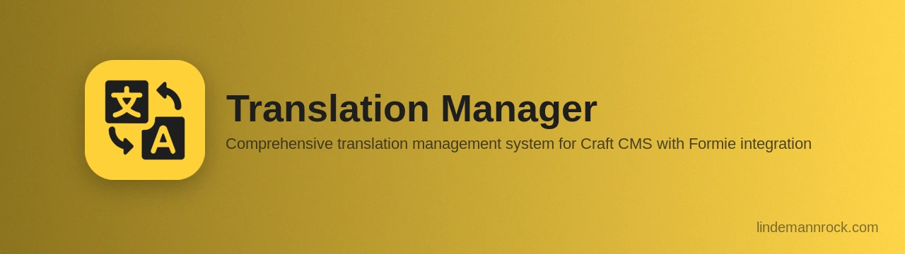

# Translation Manager Plugin for Craft CMS

[](https://packagist.org/packages/lindemannrock/craft-translation-manager)
[](https://craftcms.com/)
[](https://php.net/)
[](https://github.com/LindemannRock/craft-logging-library)
[](LICENSE)

Localize your Craft interface and Formie & Freeform forms across every language — from the Control Panel.

## Features

- **Multi-Language Site Support** — manage one key across any site/language combination with locale variant support
- **Multi-Category Support** — multiple translation categories (site, emails, errors) with separate file generation
- **Formie and Freeform Integration** — automatic capture of form fields, options, labels, messages, and button text
- **Smart Deduplication** — each unique text stored once, context updated automatically
- **Capture Missing Translations** — when enabled, auto-add translations at runtime when `|t()` encounters unknown strings
- **Locale Mapping** — consolidate regional variants (en-US, en-GB) to base locales
- **Import/Export** — CSV import with preview and validation, PHP file import/export
- **GraphQL** — Read-only translation lookup and catalog queries for headless frontends
- **Backup System** — scheduled backups with cloud storage (S3, Servd, Wasabi) and one-click restore
- **Maintenance Tools** — template & form capture, usage detection, granular cleanup
- **Statistics Utility** — Control Panel Utilities panel showing translation coverage by language
- **Security** — XSS protection, CSRF validation, path traversal prevention, CSV injection guards
- **RTL Support** — full Arabic/Hebrew text editing with proper display
- **Logging** — dedicated log files with CP viewer

## Requirements

- Craft CMS 5.10+
- PHP 8.2+
- [Logging Library](https://github.com/LindemannRock/craft-logging-library) 5.12.0+ (installed automatically)

## Installation

```bash title="Composer"
composer require lindemannrock/craft-translation-manager && php craft plugin/install translation-manager
```

```bash title="DDEV"
ddev composer require lindemannrock/craft-translation-manager && ddev craft plugin/install translation-manager
```

## Documentation

Full documentation is available in the [docs](docs/) folder.

## Support

- **Issues**: [GitHub Issues](https://github.com/LindemannRock/craft-translation-manager/issues)
- **Email**: [support@lindemannrock.com](mailto:support@lindemannrock.com)

## License

This plugin is licensed under the [Craft License](https://craftcms.github.io/license/). See [LICENSE.md](LICENSE.md) for details.

---

Developed by [LindemannRock](https://lindemannrock.com)
