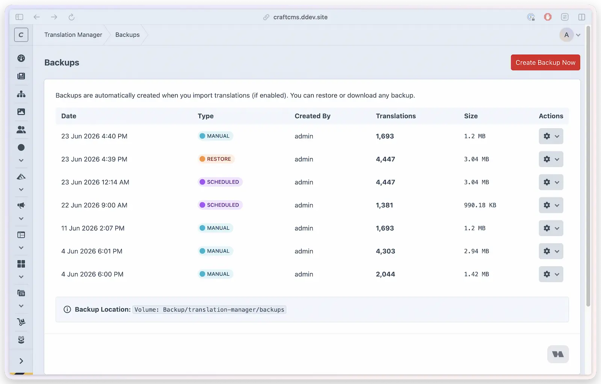

# Backup system

Translation Manager protects your translations before destructive operations that promise a safety backup. When backups are enabled, restores, maintenance cleanup, provider deletion, site-translation deletion, category deletion, **Delete All** from Settings, and imports whose backup option is enabled must finish their safety backup before changing translations. If that backup fails, the requested operation stops without deleting, replacing, importing, or regenerating translations. This guard applies only to operations that promise a safety backup; deleting selected unused rows from the Translations screen does not create one. When there are no current translations, the empty backup is a successful no-op and the operation may continue. Disabling backups keeps the deliberate no-backup behavior.

## What you'll use it for

- Creating a restore point before a big import or a round of cleanup
- Recovering after a CSV import goes wrong
- Running scheduled (daily/weekly/monthly) safety backups without thinking about it
- Keeping backups off-server in cloud storage (S3, Servd, Wasabi)
- Handing a portable ZIP of translations to another environment

## Create and restore a backup in the Control Panel

1. Go to **Translation Manager → Backups**.
2. Click **Create Backup Now** — the backup is captured with a readable timestamp, a unique suffix, and a reason. The suffix prevents simultaneous requests from choosing the same completed-backup name.
3. To roll back, find a backup in the list, click the gear icon → **Restore**, and confirm. The target, checksum, and every prospective translation row are validated first. If current translations exist and backups are enabled, a fresh safety backup must then complete before the restore replaces anything.



The list shows each backup's **date**, **type** (which folder it lives in), **reason**, **translation count**, **size**, and actual storage location. The size is the total of every stored file in that backup, including generated files under `php-files/` and any other nested backup content.

Backup creation writes and validates a request-owned staging snapshot before promoting it to the completed name. Staging and incomplete snapshots are not shown in the list, included in retention, or accepted by download, restore, and delete actions. Existing timestamp-only backup names remain supported.

## Backup types

Each kind of backup lives in its own subfolder so you can tell at a glance why it was created:

| Type | When it's created | Folder | Retention |
|------|-------------------|--------|-----------|
| **Manual** | You click *Create Backup* | `/manual/` | Never auto-deleted |
| **Scheduled** | On your daily/weekly/monthly schedule (via Craft's queue, with automatic recovery) | `/scheduled/` | Subject to retention policy |
| **Import** | Before a CSV import (when enabled) | `/imports/` | Subject to retention policy |
| **Maintenance** | Before a cleanup or clear operation | `/maintenance/` | Subject to retention policy |
| **Restore / other** | Before a restore (the safety backup) | `/other/` | Subject to retention policy |

## Configuration

```php
// config/translation-manager.php
return [
    'backupEnabled' => true,
    'backupSchedule' => 'daily', // disabled, daily, weekly, monthly
    'backupRetentionDays' => 30, // days (0 = keep forever)
    'backupOnImport' => true,
];
```

### Schedule options

| Schedule | Frequency |
|----------|-----------|
| `disabled` | No automatic scheduled backups (default) |
| `daily` | Daily |
| `weekly` | Weekly |
| `monthly` | Monthly |

Scheduled backups normally run through Craft's queue. Translation Manager keeps one delayed scheduled-backup chain for the next run and creates its successor after a completed backup or a successful empty-state no-op. An operational backup failure is reported as a failed job and does not masquerade as success. On queue transports with a bounded delay, the plugin relays the wait through intermediate queue handoffs; those handoffs do not create backups. Local and other non-SQS queue transports retain the complete native delay. Run a queue worker with `queue/listen` or a cron-driven `queue/run` so scheduled backups fire on time.

Craft stores a scheduled backup's queue description when the row is queued, so date/time format changes apply to newly queued rows; existing delayed rows keep their old label until they run or are requeued. Queue labels stay compact: numeric months render numerically, while short and long month settings both render as short month names.

## Console commands

Create a manual backup:

```bash title="PHP"
php craft translation-manager/backup/create
```

```bash title="DDEV"
ddev craft translation-manager/backup/create
```

Create one with a custom reason:

```bash title="PHP"
php craft translation-manager/backup/create --reason="Before update"
```

```bash title="DDEV"
ddev craft translation-manager/backup/create --reason="Before update"
```

Check and run a due scheduled backup directly. This command remains available for manual checks and direct-cron setups; normal automatic scheduling uses Craft's queue:

```bash title="PHP"
php craft translation-manager/backup/scheduled
```

```bash title="DDEV"
ddev craft translation-manager/backup/scheduled
```

List all backups:

```bash title="PHP"
php craft translation-manager/backup/list
```

```bash title="DDEV"
ddev craft translation-manager/backup/list
```

## Restoring, downloading, and integrity

Restore replaces all current translations with the backup's version. It requires an intact backup folder with `metadata.json` and a valid SHA-256 checksum — backups with missing metadata, missing checksum data, or modified translation JSON are rejected before a safety backup is attempted or anything is replaced. Translation Manager then decodes and validates the complete replacement catalogue before deleting a current row. Product-created backups from versions that used the historical `approved` and `ai_draft` statuses remain restorable; those statuses become `translated` and `draft` during preflight.

If any prospective row is invalid, or if a required safety backup fails, restore stops with the current catalogue and generated files unchanged. The complete delete-and-insert replacement runs in one database transaction, so an insert error rolls the entire replacement back. Translation files regenerate only after that transaction commits. If file generation itself then fails, the restore reports an error even though the database catalogue has already been replaced; resolve the reported generation problem and generate the translation files again.

Click the gear icon → **Download** to get a ZIP containing the complete stored backup content: metadata, the translation JSON files that are present, generated PHP files under `php-files/`, and any other files stored beneath that backup. Local and volume-backed downloads use the same relative paths and contain the same logical files when their stored content is identical; storage prefixes and configured volume subpaths never appear inside the ZIP. Each request owns a separate temporary ZIP, which is removed after the response and also on interruption, so simultaneous downloads cannot overwrite or clean up one another.

Downloaded ZIPs are portable: to use one on another install without an upload flow, extract it and place its files into the expected backup folder structure under that install's configured backup storage. Restore continues to read the JSON/checksum data and regenerate PHP files; it does not install the saved PHP files directly.

## Storage structure

Without a configured volume, backups remain under the effective `backupPath`:

```text
storage/translation-manager/backups/
├── scheduled/      # Automated backups
├── imports/        # Pre-import backups
├── maintenance/    # Pre-cleanup backups
├── manual/         # User-created backups
└── other/          # Miscellaneous backups
```

With a Craft volume selected, Translation Manager uses that volume for the complete backup lifecycle. Craft applies the volume's configured subpath to creation, listing, metadata, size, downloads, restores, deletion, and retention. New backups therefore live at:

```text
{configured volume subpath}/translation-manager/backups/
```

For both local paths and volumes, Translation Manager recursively builds one confined file list beneath the selected backup directory. Downloads and displayed size use that same complete file set, so nested `php-files/` content is neither omitted from the ZIP nor left out of the total.

The selected volume is authoritative. If its UID is missing, invalid, or temporarily unavailable, backup operations stop with an error instead of switching to `backupPath` or `@storage`. Translation Manager leaves the UID and effective settings unchanged, so the same configuration starts working again when the volume becomes available.

Older versions could write volume backups at the underlying filesystem-root prefix `translation-manager/backups`, outside a configured volume subpath. When the selected volume has a distinct, non-empty subpath, Translation Manager checks that exact historical prefix as a separate compatibility location. It does not scan other paths or move objects automatically. If the same backup name exists in both places, the canonical subpath-backed copy is listed, downloaded, restored, deleted, and considered for retention first; deleting it leaves the historical copy untouched. Each row reports which location it actually represents.

## Cloud storage

Store backups in any Craft asset volume — Amazon S3, Servd, Wasabi, or any provider with Craft volume support. Configure it under **Settings → Backup → Backup Storage Volume**.

Local volumes that resolve inside `@webroot` are rejected, because backup JSON files should not be web-accessible. Remote volumes such as S3 are allowed; set the bucket/object access policy in the storage provider so backups stay private.

Craft Cloud's application filesystem is ephemeral. A custom/local path and a Craft volume backed by a local filesystem are therefore unsafe for persistent backups on Craft Cloud, even when the local path is outside `@webroot`. Select a volume that uses Craft Cloud's **Cloud** filesystem type and review Craft's [local filesystem migration guidance](https://craftcms.com/docs/cloud/assets.html#local).

Backup settings evaluates the effective values after `config/translation-manager.php` overrides. On an ephemeral host, it shows the local-storage warning for an effective custom path or a valid volume backed by a local filesystem. A valid resolved non-local filesystem suppresses only this warning; it is not certification that a third-party filesystem is fully compatible with Craft Cloud. Durable hosts do not show the local-storage warning.

Any configured volume that is missing, validation-invalid, or cannot resolve its filesystem is shown as unavailable on both ephemeral and durable hosts. The settings page replaces the location display with an actionable unavailable-volume error and does not label the volume as local fallback or durable storage. It never shows that error together with the local-storage warning. The presentation does not change or persist settings, and operational backup actions continue to fail closed without using local storage. Restoring the same volume or filesystem lets the unchanged UID recover automatically.

## Retention policy

- Automatic cleanup is based on the `backupRetentionDays` setting.
- **Manual backups are never automatically deleted.**
- Set retention to `0` to keep all backups forever.
