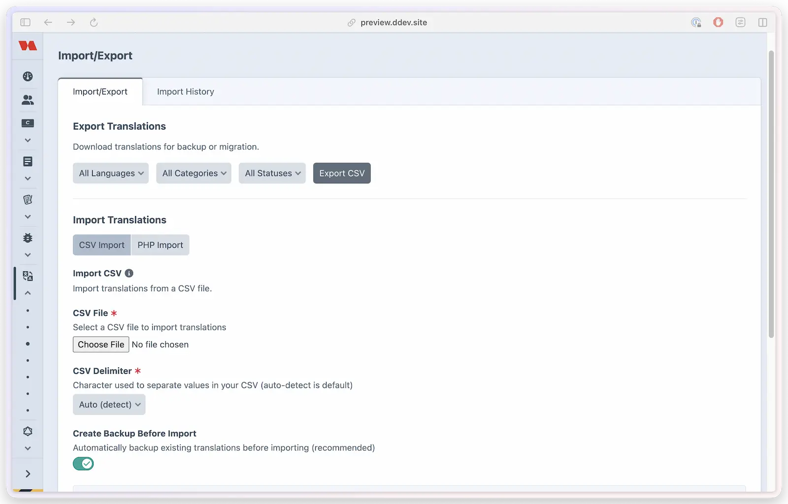
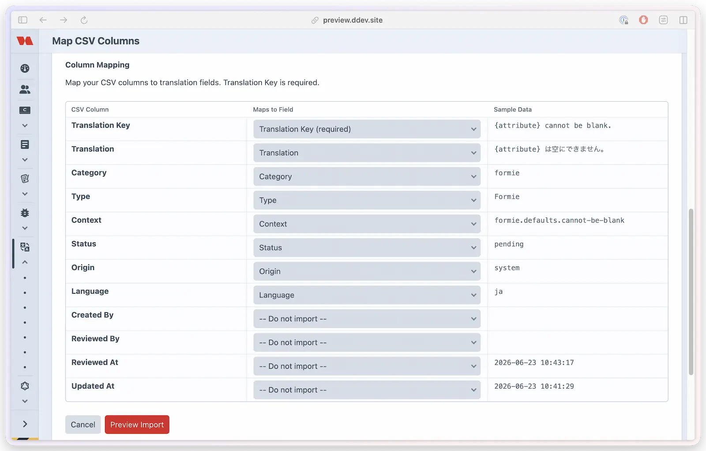
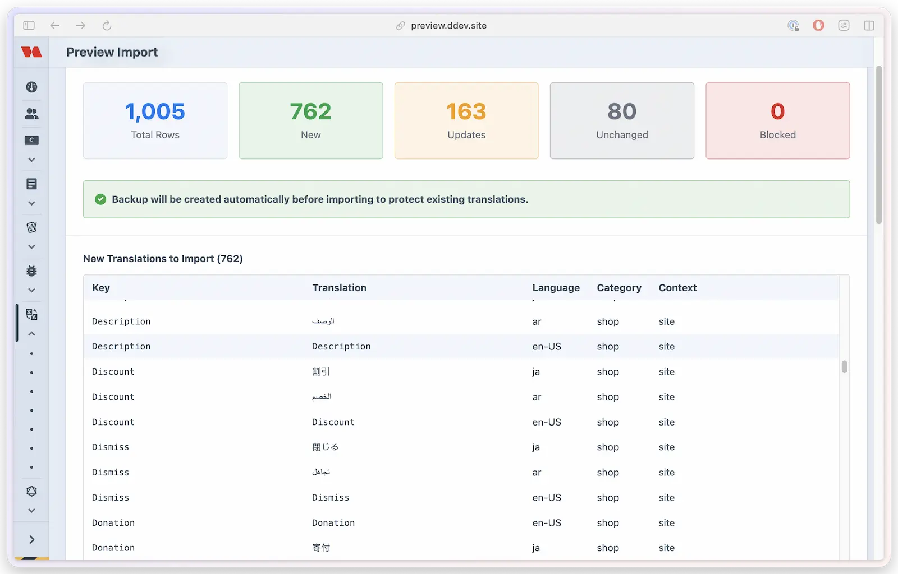

# Import / export

Move translations in and out of Translation Manager in bulk. Export your strings as CSV to hand to a translator, import their work back with a preview before anything changes, and generate the production PHP files Craft loads at runtime — or pull existing PHP translation files in to manage them here.

## What you'll use it for

- Sending strings to an external translator as a CSV and importing the finished file back
- Onboarding a project that already has translations (CSV or PHP files)
- Generating production-ready PHP translation files for deployment
- Bringing another plugin's frontend translations under Translation Manager's management

## Import a CSV in the Control Panel

Importing is a guided four-step flow — upload, map columns, preview, confirm — so you always see exactly what will change before it's written.



1. Go to **Translation Manager → Import/Export**.
2. **Upload.** Choose your CSV file (max 5 MB). Pick a **CSV Delimiter** if needed — the default **Auto (detect)** handles most files, with **Comma (,)**, **Semicolon (;)**, **Tab**, and **Pipe (|)** available. When backups are enabled, leave **Create Backup Before Import** on. Click **Upload & Map Columns**.
3. **Map CSV Columns.** Translation Manager matches your headers to its fields automatically, but you can adjust each one on the **Map CSV Columns** screen — every CSV column maps to a field via the **Maps to Field** dropdown, with a **Sample Data** preview alongside. **Translation Key (required)** is the only mapping you must set; **Translation**, **Language**, **Category**, **Context**, **Type**, **Site ID**, **Status**, and **Origin** are optional, and **-- Do not import --** skips a column. Click **Preview Import**.
4. **Preview.** Review the **new**, **updated**, **unchanged**, and **blocked** counts before anything is written. Blocked rows include malicious content and values that cannot satisfy the same record rules used for the final save, such as a context longer than 255 characters or a category longer than 50 characters.
5. **Confirm** the import, then check the results and [history](#import-history).

On the **Map CSV Columns** step, each column is matched to a field — adjust any that didn't auto-detect:



The **preview** then shows exactly what will change — new, updated, unchanged, and blocked rows — before you confirm:



When backups are enabled and **Create Backup Before Import** is selected, the backup must succeed before Translation Manager writes any row. A backup failure stops the import and leaves the preview available so you can retry safely.

## Export

Export translations with your current filters applied. Three formats are available — **CSV**, **Excel**, and **JSON** — each turned on or off under **Settings → Interface**.

**Export contents:** English text (the key), the site-specific translation, type (Forms/Site), context (if enabled), and status.

### From the Import/Export page

Go to **Translation Manager → Import/Export**, apply any Language / Category / Status filters, and click **Export CSV** — the file downloads with that filter applied.

### From the translations list

The **Translations** screen has its own **Export** menu that respects whatever you've filtered (or selected). Open it and choose **Export as CSV**, **Export as Excel**, or **Export as JSON** (only the formats you've enabled appear).

To export just a subset, tick the rows you want first — the button shows the count, e.g. **Export (12)**, and the download contains only those rows, still honouring your active filters. Leave everything unticked to export the full filtered set.

Exports are protected against CSV injection — leading special characters are prefixed so spreadsheet applications can't execute them as formulas.

## CSV import

### CSV format

```csv
English Text,Arabic Translation,Status,Context
"Welcome to our website","مرحباً بكم في موقعنا","translated","site"
"Contact Us","اتصل بنا","translated","site"
"Submit","إرسال","translated","formie.contactForm.button.submit"
"Contact Us","اتصل بنا","translated","freeform.contactForm.title"
```

### Required columns

| Column | Aliases | Required |
|--------|---------|----------|
| English Text | English, Source, Original | Yes |
| Translation | Arabic, Translated | No |
| Context | Category, Type | No (defaults to `site`) |
| Status | - | No |

### Import behavior

- Updates an existing translation with the same key, mapped language, and category
- Creates new translations for unmatched entries
- Skips unchanged entries and reports invalid or rejected rows as failed
- Keeps valid row writes when another row fails; the final message reports partial success rather than hiding the failure
- Reports a complete failure when no row could be written

The final result separates new, updated, skipped, and failed totals. Import History preserves the full failed-row count even when only the first 10 error details are retained for review. If you correct and retry the same file, rows already written successfully are matched as existing translations rather than inserted again.

Automatic file generation runs only when the import actually creates or updates at least one translation and auto-generation is otherwise enabled. A completely rejected import does not regenerate files.

A translation value of `0` is imported as real translated text, not as an empty value. Empty, whitespace-only, and `null` values remain untranslated. PHP file imports follow the same rule, including a string key or value of `"0"`.

### Security

CSV import is guarded by file-type validation (CSV/TXT only), a 5 MB size limit, MIME-type verification, malicious-content detection (XSS, SQL injection, PHP code), input sanitization, CSRF protection, and a required pre-import backup when backups are enabled and selected for the import.

## PHP file export (generation)

Generate production-ready PHP translation files. Translation Manager writes them into Craft's `@translations` root — the generation path must resolve to that root exactly so Craft can load the files at runtime; subfolders such as `@root/translations/test` or `@translations/test` are not valid targets.

Generated files stay useful even when the runtime source is `hybrid`: in that mode they provide fallback values for enabled categories when no translated database row exists, while database rows override matching keys. See [Runtime translation source](../get-started/configuration.md#runtime-translation-source).

### Generated structure

```text
translations/
├── en-US/
│   ├── messages.php   (site translations)
│   ├── formie.php     (Formie translations)
│   └── freeform.php   (Freeform translations)
└── ar/
    ├── messages.php
    ├── formie.php
    └── freeform.php
```

> [!NOTE]
> The site-category filename matches your configured translation category — `messages.php` for the default `messages` category, or your own name if you changed it.

Generation reconciles each category and mapped language independently. If one language no longer has any translated values in the requested scope, Translation Manager removes that language's stale category file while retaining files for other languages and unrelated categories or providers. A value of `"0"` remains in the generated file.

### Auto generate

Enable auto-generation in settings to refresh PHP files whenever translations are saved or imported (CSV, Excel, and PHP imports all trigger a refresh).

If the configured generation path changes, Translation Manager regenerates the current files into the new valid `@translations` location after the settings save succeeds. It does **not** delete files from the previous physical location.

### Manual generation

1. Go to **Translation Manager → Generate**.
2. Choose **All**, **Site**, a single site category, or a form provider (such as Formie or Freeform).
3. Click **Generate**.

Provider generation writes only that provider's category file — Formie writes `formie.php`, Freeform writes `freeform.php`.

On split-runtime hosting a deploy command can generate and verify PHP files successfully while frontend requests still don't consume them reliably. In that environment use `hybrid` as the runtime source, and keep generation enabled for PHP fallback files, exports, native plugin fallback values, and compatibility with Craft's standard translation folder.

### Console commands

Generate all translation files:

```bash title="PHP"
php craft translation-manager/translations/generate-all
```

```bash title="DDEV"
ddev craft translation-manager/translations/generate-all
```

Generate site translation files only:

```bash title="PHP"
php craft translation-manager/translations/generate-site
```

```bash title="DDEV"
ddev craft translation-manager/translations/generate-site
```

Generate one site category only:

```bash title="PHP"
php craft translation-manager/translations/generate-category messages
```

```bash title="DDEV"
ddev craft translation-manager/translations/generate-category messages
```

Generate one form provider's files only:

```bash title="PHP"
php craft translation-manager/translations/generate-provider formie
```

```bash title="DDEV"
ddev craft translation-manager/translations/generate-provider formie
```

## PHP file import

Import existing PHP translation files into Translation Manager. This is useful for:

- Importing translations from other Craft plugins
- Migrating from file-based translation management
- Onboarding projects that already ship translation files

### Importing plugin translations

To manage translations for a third-party plugin that provides frontend content:

1. **Add the category** in **Settings → Translation Sources → Translation Categories** — use the plugin's handle (e.g. `commerce`, `events`, `pluginX`).
2. **Locate or copy the translation file:**
   ```text
   translations/
   └── ar/
       └── pluginX.php    ← Plugin translation file
   ```
3. **Import via PHP Import:** go to **Translation Manager → Import/Export**, scroll to *Import from PHP Files*, select the file (e.g. `ar/pluginX.php`), let the category auto-detect from the filename, then preview and import.

### File detection

PHP Import scans your configured translations folder and detects:

- **Language** from the folder name (e.g. `ar`, `en-US`, `fr`)
- **Category** from the filename (e.g. `pluginX.php` → category `pluginX`)

### Import behavior

- Creates translations for **all** configured site languages
- Pre-fills source-language translations with the key
- Uses the imported values for the target language
- Updates existing translations rather than duplicating them
- Takes an automatic backup before import (when enabled)

Provider files such as `formie.php` and `freeform.php` import into their matching provider categories. Custom site categories import into the configured category with the same filename.

### Example workflow

Importing a plugin's Arabic translations:

```text
# 1. Plugin provides translations at:
plugins/my-plugin/src/translations/ar/my-plugin.php

# 2. Copy to the site translations folder:
cp plugins/my-plugin/src/translations/ar/my-plugin.php translations/ar/

# 3. Add the 'my-plugin' category in Translation Manager settings

# 4. Use PHP Import to import the file

# 5. Manage the translations in Translation Manager

# 6. Export updates back to translations/ar/my-plugin.php
```

### Requirements

- PHP Import is only available in **devMode** (for security)
- The user needs the **Import Translations** permission
- Files must be in the configured generation path (default `@translations`)

## Import history

Every confirmed import is tracked with its date and time, the user who ran it, the number of translations (new / updated / skipped / failed), the total error count, retained row-level error details, and a link to the pre-import backup. A mixed result stays visible as a partial failure, while an import that writes nothing and rejects every row is recorded as a complete failure.

To wipe the log — for example after testing imports — use the **Clear history** button on the Import History tab. It removes every history record (the backups themselves are untouched) and requires the **Clear Import History** permission. See [Permissions](../developers/permissions.md).
